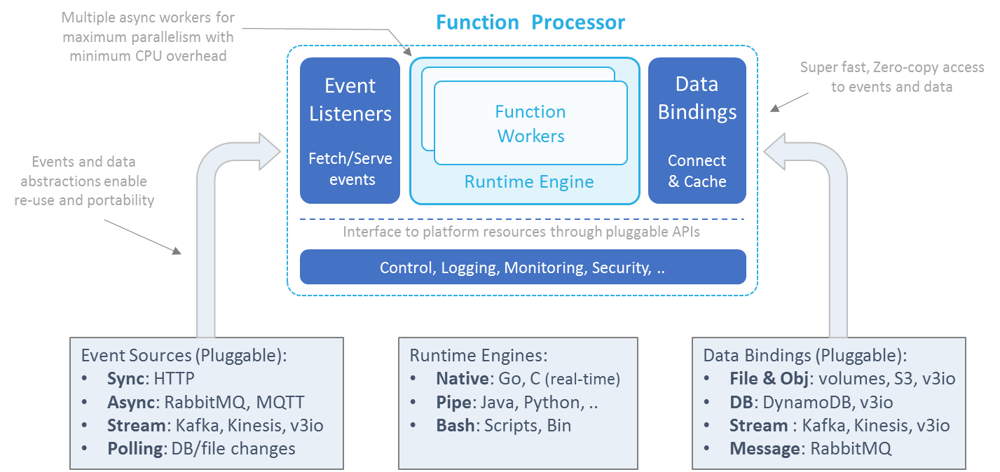

# Function Processors

Function processors provide an environment for executing functions.
The processor feeds functions with events, provides context and data, collects logs and statistics, and manages the function's life cycle.  

Processors can be compiled into a single Go or C binary, or packaged into a container with all the required code dependencies.
Processor containers can run as standalone Docker containers, or on top of a container-orchestration platform such as Kubernetes.

## Processor Architecture

nuclio's unique processor architecture is aimed at maximizing function performance and providing abstractions and portability across a wide set of platforms, event sources, and data services. 

The processor has four main components:

### Event-Source Listeners 

Event-source listeners can listen on sockets and message queues, or periodically fetch events from external event or data sources.
Received events are mapped to a common schema (decoupling function logic from the implementation of the event source), and pushed to one or more parallel runtime workers.  
The event listeners also guarantee event execution &mdash; for example, by storing stream checkpoints, acknowledging message-queue events, or responding to HTTP client requests.

### Runtime Engine

The runtime engine ("runtime") initializes the function environment (variables, context, log, data bindings, etc.), feeds event objects into functions workers, and returns responses to the event sources.  
Runtimes can have multiple independent parallel workers (for example, Go routines, Python asyncio, Akka, or threads) to enable non-blocking operations and maximize CPU utilization.

nuclio currently supports three types of processor runtime implementations:  
1.	Native &mdash; for real-time and inline Go or C-based routines.

2.	SHMEM &mdash; for shared-memory languages, such as Python, Java, and Node.js.  
    The processor communicates with the SHMEM function runtime through zero-copy shared-memory channels.

3.	Shell &mdash; for command-line execution functions or binaries ("executables").  
    Upon receiving an event, the processor runs the executable in a command-line shell, using the relevant command and environment variables, and then maps the executable's standard-output (`stdout`) or standard-error (`stderr`) logs to the function results.  
    **Note:** The shell runtime supports only file data bindings.

### Data Bindings 

Functions can benefit from persistent data connections to external files, objects, databases, or messaging systems.
The runtime initializes the data-service connection based on the type, URL, properties, and credentials specified in the function specification, and serves them to the function through the context object.  
Data bindings simplify development by eliminating the need to integrate with SDKs or manage connections and credentials.
They also enable function reuse and portability, because different data services of the same class are mapped to the function using the same APIs.  
Data bindings can also handle aspects of data prefetching, caching, and micro-batching, to reduce execution latency and increase I/O performance.
Data bindings and event sources are designed with zero-copy, zero-serialization, and non-blocking operation, and enable real-time performance without the need for any special function code.

### Control Framework 

The control framework initializes and controls the different processor components, provides logging for the processor and the function (stored in different log streams), monitors execution statistics, and serves a mini portal for remote management.  
The control framework interacts with the underlining platform through abstract interfaces, allowing for portability across different IoT devices, container orchestrators, and cloud platforms.
The platform-specific processor configuration is done through a **processor.yaml** file in the working directory.
Function developers should not modify this file. 

